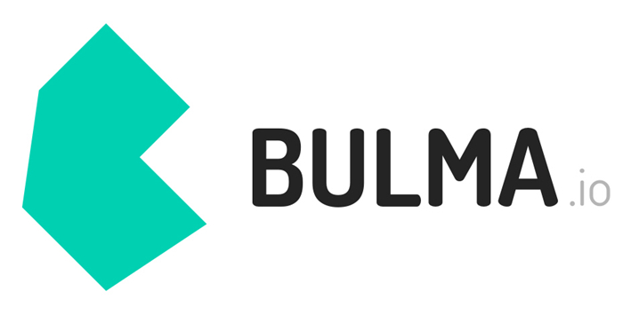
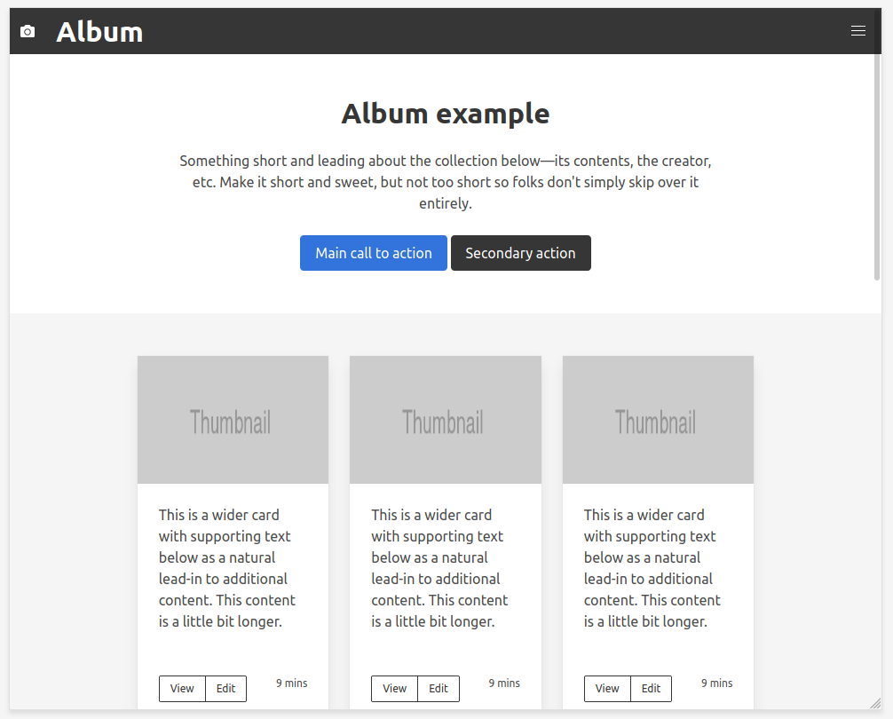

<p align="center">
    
</p>

# Evaluation sur le framework bulma

C'est une évaluation que j'ai beaucoup apprécié et que j'ai envie de partager.

Vous trouverez le sujet plus bas, mais je vous l'explique briévement ici.

Il s'agit de copier visuellement une page réalisé avec le framework __Bootstrap__ mais en utilisant le framework __Bulma__ à la place.

## Le framework inconnu

Le défi sur cette évaluation était de développer cette page en partant de rien mais surtout d'utiliser un framework __inconnu__ ! En effet je n'avais jamais utilisé __Bulma__ et je devais donc assimiler la documentation et m'approprier cette technologie dans un temps limité qui plus est ! L'évaluation devait être rendu dans la journée, ce que j'ai respecté :)

Je vous laisse aprécier le résultat ci-dessous :



La page est bien entendu __Responsive__ et est codé sans une ligne de __CSS__. Uniquement avec le framework __Bulma__ ajouté de cette manière :

```html
<link rel="stylesheet" href="https://cdn.jsdelivr.net/npm/bulma@0.8.2/css/bulma.min.css">
```

Ce que j'ai apprécié dans cette évaluation, c'est le fait d'être mis en situation comme tu pourrais l'être en entreprise.

Ton chef d'équipe ou ton client t'impose une technologie que tu ne connais pas et tu dois rendre quelque chose de propre dans un temps imparti.

C'est un défi comme je les aimes :)


<a href="https://aimeos.org/">
    
</a>

# EVAL | Séquence W4

### Responsive Design | AJAX

Ce dépôt contient l'ensemble du matériel nécessaire pour l'évaluation de fin de séquence W4.

Si tu es déjà habitué à travailler avec Git et GitHub, nous te conseillons de travailler avec la version CLI de Git. Dans le cas contraire, nous t'invitons à utiliser [GitHub Desktop](https://desktop.github.com/), le temps de bien comprendre les concepts fondamentaux de Git.

_______

Ce sujet d'évaluation se compose d'une  épreuve :

1. **Reproduction d'une page web à l'aide d'un framework CSS**


### Consignes

Comme pour tous les grands artisans, avant le temps de la création, vient le temps de l'apprentissage qui consiste à recopier, jusqu'à la perfection, les travaux de leurs maîtres.

C'est ce travail que nous te proposons aujourd'hui.

La page ci-dessous es réalisée avec Bootstrap4 :

https://getbootstrap.com/docs/4.0/examples/album/

Ton travail d'aujourd'hui consiste à réaliser la même page (au plus proche) avec [Bulma](https://bulma.io/).

L'aspect "AJAX" étudié dans cette séquence pédagogique fera l'objet d'une évaluation utlérieure, au sein d'un projet de plus grande envergure.

_______

Le temps total imparti pour cette épreuve est d'une journée.

Bon courage !
